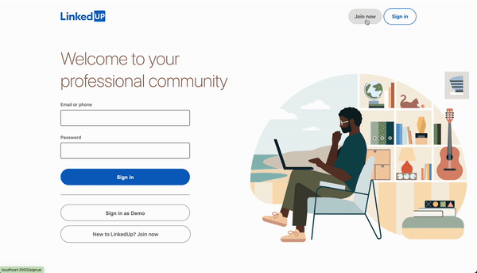
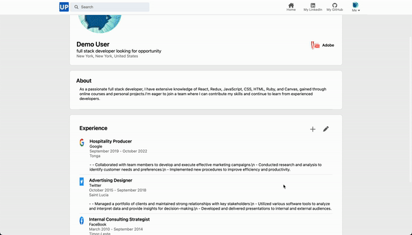
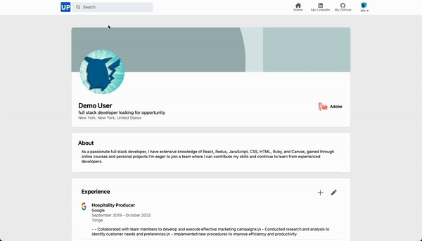
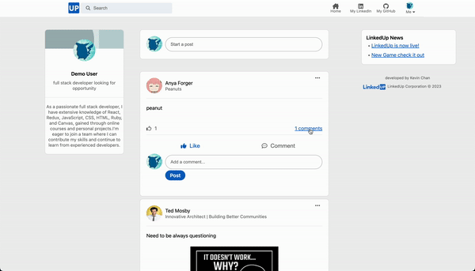
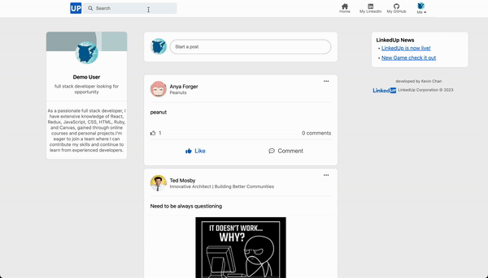
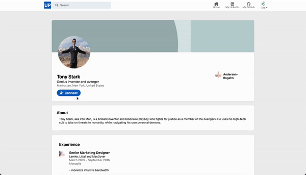

# WELCOME TO LINKEDUP

Check out the [Live Site](https://linkedup-ptj7.onrender.com/)

### Introduction

LinkedUp is a clone of the LinkedIn website at the time of creation. LinkedIn is a social media platform that focuses on professional networking. It allows users to create profiles, connect with other professionals, and share content related to their industry.  The technologies implemented in this project include:

* Languages: Javascript, Ruby, HTML, and CSS
* Frontend: React-Redux
* Database: PostgreSQL
* Hosting: Render
* Asset Storage: AWS Simple Cloud Storage (S3)

# MVPs

## Profiles

A LinkedUp user is able to create new profiles, which persist to both the front and backend, and select existing or newly created profiles in order to begin: 



A LinkedUp user can also manage their profile's show page, which is their experiences by adding, editing and deleting:



```
{experiences && experiences.map(experience => (
<div className='profileDetailList' key={experience.id}>
    <div className='profileLogo'>
        {experience.logo ?
         :
        }
    </div>
    <ul className='experienceDetail'>
        <li className='detailHeading'>{experience.title}</li>
        <li className='detailSubHeading'>{experience.company}</li>
        <li className='period'>
            {experience.startMonth + ' ' + experience.startYear + ' - '} 
            {experience.current ? 'Present' : (experience.endMonth + ' ' + experience.endYear)}
        </li>
        <li className='detailLocation'>{experience.location}</li>
        <li className='detailDescription'>{'- ' + experience.description}</li>
    </ul>
</div>
))}
```

## Posts

On the home page, a LinkedUp user can views all the posts on the feed. They are able to create a post, deleting and editing it.



```
<div className="postBody">
    <p>{post.body}</p>
    {post.photoUrl ? </img> : null}
</div>

<div className="postLikesComments">

    {post.likesCount ? (
    <div className="likesCount">
        <i className="fa-regular fa-thumbs-up" id="likesCountIcon"></i>
        {post.likesCount}
    </div>) : 
    <div className="likesCount">
        <i className="fa-regular fa-thumbs-up" id="likesCountIcon"></i>
        0
    </div>}

    {post.comments ?(
    <div className="commentsCount" onClick={() => listComments(post.id, index)}>
        {post.comments.length} comments
    </div>) : null}
    
</div>
```

## Feeds

And also under each post, they can comment and like, and deleting, editing comment and unlike.



## Search

On any page after signed in, a LinkedUp user can also search for user by typing the user's name that they want to search for. As user starts typing to search, the search result will apply different font weight to show what's matching the user's input.



<!-- ```
<div className="modal-content" id='searchModalConetent'>
    {(query !== '') && (
    <ul>
        {users.filter(user => {
            const parts = query.toLowerCase().split(' ');
            return parts.every(part => user.firstName.toLowerCase().includes(part) || user.lastName.toLowerCase().includes(part));
        }).map((user, index) => (
            <li key={index} onClick={() => checkOutProfile(user.id)} className='searchResult'>
                <i className="fa-solid fa-magnifying-glass" id='insideSearch'></i> 
                <div className='authorPic' id='searchPhoto'>
                    
                </div>
                <div className='fullName'>
                    {user.firstName.split('').map((letter) => 
                        <div>
                            <p className='matched'>{matchedWord(letter)}</p> <p>{unmatchedWord(letter)}</p>
                        </div>)} 

                    <p>&nbsp;</p>

                    {user.lastName.split('').map((letter) => 
                        <div>
                            <p className='matched'>{matchedWord(letter)}</p> <p>{unmatchedWord(letter)}</p>
                        </div>)}
                        <div className='headlineSearch'>&nbsp; &bull; &nbsp;{user.headline}</div>
                </div>
            </li>
        ))}
    </ul>
    )}
</div>
``` -->

## Connections

A LinkedUp user can also connect and unconnect other user on LinkedUp



```
{sessionUser.id !== user?.id ?
<div className='interactButtons'>
{user?.connected ?
    <button onClick={unconnect} className='submit' id='connectButton'>
        <i className="fa-solid fa-user-plus" id='connectIcon'></i>
        <p>Unconnect</p>
    </button> : 
    <button onClick={handleConnect} className='submit' id='connectButton'>
    <i className="fa-solid fa-user-plus" id='connectIcon'></i>
    <p>Connect</p>
</button>
}
</div> : null}
```

### Thanks

LinkedUp was created within a 14 day time frame. Thank you for your time and consideration! I hope you enjoy it!
